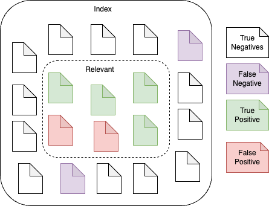
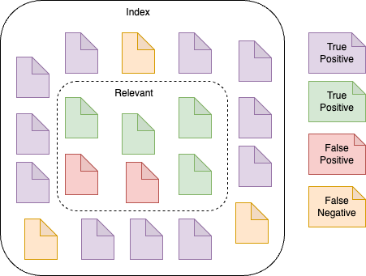

# API

In this section we cover some aspects of Elasticsearch API.

* [Clusters and nodes](#clusters-and-nodes)
* [Indexing](#indexing)
* [CURD](#crud)
* [Search](#search)

[REST APIs Official Documentation](https://www.elastic.co/guide/en/elasticsearch/reference/current/rest-apis.html)

## Clusters and Nodes

1. Health check
```
GET _cluster/health
```

2. Node status
```
GET _nodes/stats
```

[Full list of Cluster API operations](https://www.elastic.co/guide/en/elasticsearch/reference/current/cluster.html)

## Indexing

1. Getting a list of indices
```
GET /_cat/indices
```

2. Creating index
```
PUT <index name>
```
[Full list of index API](https://www.elastic.co/guide/en/elasticsearch/reference/current/indices.html)

## CRUD

* [Create](#create)
* [Read](#read)
* [Update](#upate)
* [Delete](#delete)

[Full list of document API](https://www.elastic.co/guide/en/elasticsearch/reference/current/docs.html)

### Create 

1. Autogenerate document id:
```
POST <Name-of-index>/_doc
{
    "field": "value"
    ...
}
```

2. Assign custom document id and this will replace document content with the same id:
```
PUT <Name-of-index>/_doc/<your-assigned-id>
{
    "field": "value"
}
```

3. Ignore if a document id already exist (returns a 409)
```
PUT <Name-of-index>/_create/<your-assigned-id>
{
    "field": "value"
}
```
 
### Read

```
GET <Name-of-index>/_doc/<id-of-document>
```

### Upate

```
POST <Name-of-index>/_update/<id-of-doc-to-update>
{
    "doc":{
        "field": "value", // field to update
        ....
    }
}
```

### Delete

```
DELETE <Name-of-Index>/_doc/<id-of-doc-to-delete>
```

## Search

There are a a number of factors to consider in a search operation:

* [Precision](#precision)
* [Recall](#recall)
* [Ranking](#ranking)
* [Syntax](#syntax)


Refer to the [Beginner's Crash Course to Elastic Stack - Part 2: Relevance of a search](https://www.youtube.com/watch?v=CCTgroOcyfM) for tutorial

### Precision 

Precison tells us what portion of the **retrieved** data is actually relevant to the search query.

Precision is calculated based on this formula:

`Precision = True Positives / True Positives + False Positives`

Where false positives are documents that are relevant but not returned.



### Recall

Recall is what porpotion of relevant data is being return as search result. 

The calculation is
`Recall = True Positive / True Positive + False Negaitves`.



### Ranking

Precision and recall do not determined which of the documents are more relevant. Ranking prders the search result from most relevant (top) to least relevant (bottom).

Ranking is determined by a score.

### Score

A score is a value that represents how relevant a document is to a specific query. A score is computed for each document that is a `hit` (returned by a search). The higher the score the higher is ranking.

Method of scoring:
* Term Frequencies -- how many times a term occurs in each document
* Inverse Document Frequencies -- if the search term is found in many document, it is not revelant. It will focus on term frequencies in document with important search terms.

### Syntax

1. Search by index
```
GET <index>/_search
```

2. Get the exact total number of hits
```
GET <index>/_search
{
  "track_total_hits": true
}
```

## References

* [Official API Reference](https://www.elastic.co/docs/api/doc/elasticsearch/)
* [API Quick Start](https://www.elastic.co/docs/solutions/search/api-quickstarts)